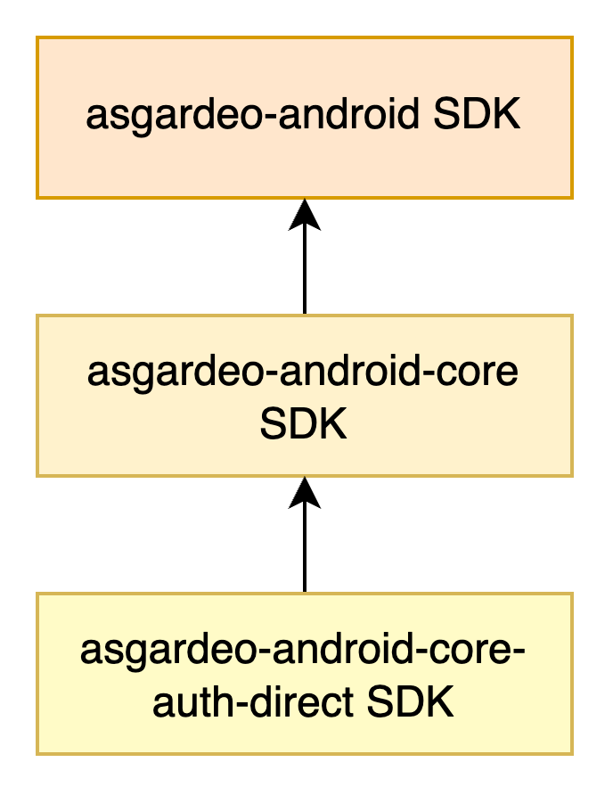
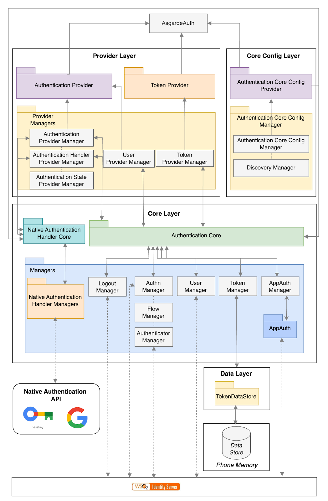

# Architecture of the Asgardeo Android SDK

The Asgardeo Android SDK is designed to provide a seamless integration experience for your Android applications with Asgardeo. Currently this SDK has the following components:

- **Main SDK (asgardeo-android)**:
  This is the main SDK that provides all the necessary functionalities to integrate your Android application with Asgardeo.

- **Core SDK (asgardeo-android-core)**:
  This is the core SDK that provides the core functionalities(not any UI components) to integrate your Android application with Asgardeo.

- **Core Auth Direct SDK (asgardeo-android-core-auth-direct)**:
  This is a part of the core SDK that provides the core authentication functionalities using [app-native authentication](https://wso2.com/asgardeo/docs/guides/authentication/app-native-authentication/) to integrate your Android application with Asgardeo.

## How each component is connected

Using the main SDK, you can integrate your Android application with Asgardeo. The main SDK internally uses the core SDK to provide the necessary functionalities. The core SDK uses the core auth direct SDK to provide the core authentication functionalities using app-native authentication.

The main SDK and the core SDK does not have any code in their components. They are just a collection of dependencies that are required to integrate your Android application with Asgardeo. The core auth direct SDK has the actual code that provides the core authentication functionalities using app-native authentication.

## Architecture of the Core Auth Direct SDK

The above image depicts the full-scale architecture of the Asgardeo Android Core Auth Direct SDK. This SDK can be divided into four main layers:

- Provider Layer
- Core Config Layer
- Core Layer
- Data Layer

Let's look at each of these layers separately.

### Provider Layer
This layer has all the functions needed by an Android developer to integrate app native authentication into their Android application. As shown in the diagram, the provider layer consists of three main components:

- Authentication Provider
- Token Provider
- Provider Managers

Both the Authentication and Token providers have wrapper functions that call functions in a provider manager, which then call the implemented functions in the core layer.

The Authentication Provider exposes functionality necessary for app native authentication, such as `initializeAuthentication()`, `authenticateWithUsernameAndPassword()`, and `logout()`. 

The Token Provider exposes functionality to handle tokens, such as `getAccessToken()` and `validateAccessToken()`.

Provider Managers have manager classes that call functions in the core layer, for example, the user provider manager calls functions related to getting user information.

### Core Config Layer
When using the SDK, the developer can either use the discovery endpoint or add all the necessary endpoints like authorize and token endpoints. This layer sets the SDK configurations based on the data provided by the developer. If the developer has entered the discovery endpoint of their Asgardeo organization, this layer will call it, fetch all necessary endpoints, and set them accordingly.

### Core Layer
This layer contains all the implementations and is where the magic happens in the SDK. It consists of three components:
- Authentication Core
- Native Authentication Handler Core
- Managers

The Authentication Core and Native Authentication Handler Core are wrapper classes for functions implemented in the Managers. The provider layer interacts with these core classes without knowing the implementation details, which are encapsulated in the Managers.

The Authentication Core class holds wrapper functions for app native authentication-related functions. Additionally, the SDK provides functionality to call native authentication APIs directly, such as Google's credential manager API. 

The Native Authentication Handler Core wraps those native functions, implemented in the native authentication handler managers.

The Managers handle specific unit actions; for example, the user manager handles API calls related to getting user information from Asgardeo. If you look closely in the managers component in the core layer you will see a manager called AppAuth Manager, which is responsible for calling the Android AppAuth SDK, to handle the lifecycle of the token. Since this SDK already has this logic implemented, we chose to use it directly in our SDK instead of reinventing the wheel.

### Data Layer
The final layer in the SDK is the Data Layer. This layer is responsible for storing and retrieving token information in the phone memory. To store data, this SDK uses the datastore library provided by Android. This layer allows developers to skip the login interface when a user returns to their app and already has a valid token.

### Why so many layers ?
Now that you have a better understanding of the architecture of the Asgardeo Android Core Auth Direct SDK, you might be wondering why there are so many layers in the Asgardeo Android Core Auth Direct SDK. The reason is to increase the maintainability of the SDK. By having multiple layers, the higher layers, such as the provider layer, are abstracted from the implementation details. This separation allows us to modify the implementation without affecting the developer's code, ensuring a more robust and flexible SDK.
